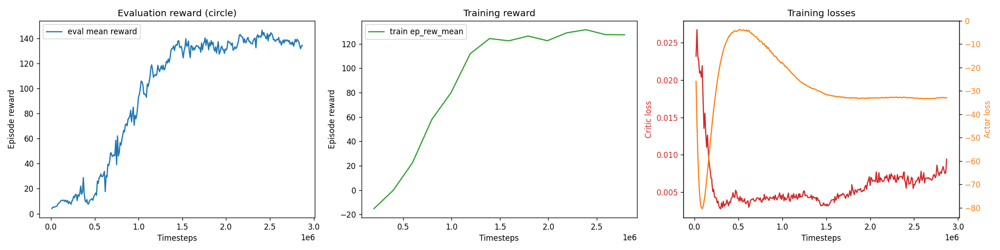
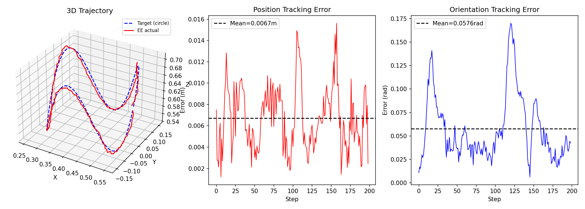
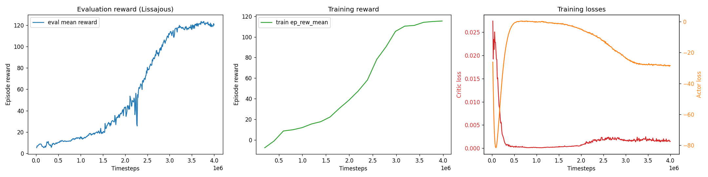
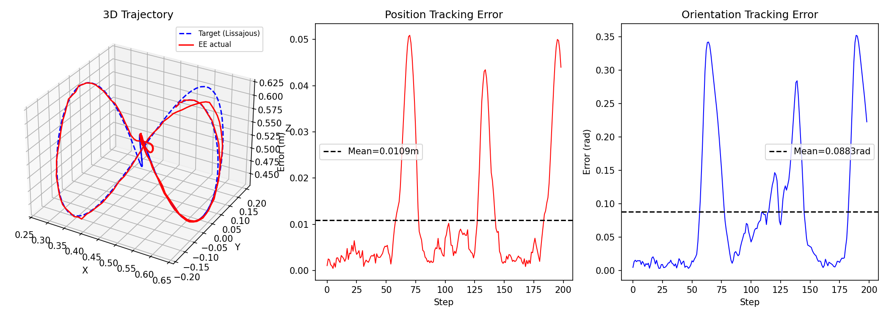

# 3D End-Effector Tracking

**RL Based Robotic Controller**

A reinforcement learning system that trains a robotic arm to follow a trajectory target through 3D space, matching both position and orientation.

A Truncated Quantile Critics (TQC) agent learns to control the arm directly in joint space. Designed for Linux hosts.

---

## How it works

A TQC agent observes the noisy state of the arm and the (clean) state of the target, and outputs small changes to the joint angles (Δq). MuJoCo's position actuators execute them. Over a few million steps the agent learns the inverse kinematics implicitly.

- **Simulator** — MuJoCo 3.x, Franka Emika Panda 7-DOF arm, wrapped as a Gymnasium environment.
- **Control** — joint position actuators driven by delta-angle commands.
- **Agent** — TQC (sb3-contrib): off-policy, distributional actor-critic, with a 400k-transition replay buffer.
- **Training targets** —  Random curves of the same type (Lissajous or circular).
- **Evaluation target** — a fixed Lissajous or Circular Helix curve, so the eval score is a stable, comparable benchmark across runs.
- **Uncertainty source** — Gaussian noise on the observed end-effector pose and joint angles.

---

## Results

**Demo of the final policy following the evaluation trajectory**
| Circular Helix| Lissajous |
|---|---|
| |  |

Both policies were trained and evaluated with substantial observation noise. σ = 0.005 m on the measured end-effector position and σ = 0.01 rad on its orientation. For a manipulator this is on the pessimistic side. 
A real Franka's proprioception is tighter. This noise sets a floor on achievable accuracy. Every noisy observation causes a corrective action. The smoothness penalty `β` mitigates this by penalising abrupt changes in action. This makes the path smoother, however, larger `β` buys a smoother trajectory at the cost of a slightly looser track. In other words, `β` controls the trading of **precision against smoothness**.

**Circular Helix Training**

Training lasted for ~2.8M timesteps, until a plateau was detected on the evaluation reward curve, meaning no further training was required. Plot shows also a plateau on the reward curve. 


The best policy obtained from training was evaluated using a 3D circular helix curve, to demonstrate full capabilities of the agent. 


Final results show a mean error of 6.7mm in position tracking, and 0.057rad in orientation tracking. 

**Lissajous Training**

Training lasted for ~4M timesteps, until the evaluation reward plateaued. This is confirmed by the following plots. Training reward kept steadily climbing, and the actor-critic losses show a good behaviour. 


The best policy obtained from training was evaluated using a 3D Lissajous curve, to demonstrate full capabilities of the agent. 



Final result shows  a mean error of 1cm and 0.08 rad across the trajectory. Main source of error was right after the crossing in the middle of the trajectory. At that specific point, the agent has trouble differentiating which way it is going to, and where it is coming from, so it separates from the target. A few steps later, it converges again. 


---

## Design choices

### Joint-space delta control, with implicit inverse kinematics

The agent outputs **delta joint angles** (Δq) — small per-joint changes, capped at `max_delta_q` each step. The agent learns the arm's kinematics purely from experience, while MuJoCo's built-in PD controller handles the dynamics of reaching each commanded angle. The trained policy is the task-specific inverse-kinematics controller.

### Truncated Quantile Critics (TQC)

TQC is an off-policy actor-critic algorithm. It stores every transition in a replay buffer and reuses it for many gradient updates, which is sample-efficient, making it ideal when the simulator runs on CPU with 8 parallel environments. TQC represents each critic as a *distribution* over returns and truncates the top quantiles when forming the target, which controls the value-overestimation bias.

### Target trajectories, randomized for training

**Training** re-samples a **randomized curve** every episode — random per-axis amplitude, frequency and phase. Re-randomizing every episode forces the agent to learn tracking as a genuine skill rather than memorize one path.

**Evaluation** uses a single fixed **curve**. Because training already covers the same family of motion (and the same speeds), the eval curve is in-distribution, and the eval score is a stable, comparable benchmark across runs rather than a noisy out-of-distribution probe.

### Orientation: 6D representation and geodesic error

Orientations are encoded with the continuous 6-dimensional representation rather than quaternions or Euler angles. Quaternions have a double-cover discontinuity and Euler angles have gimbal-lock singularities; both create points where a tiny rotation causes a large jump in the encoding. The 6D form is continuous everywhere.

The orientation error in the reward is the **geodesic distance** on SO(3).

### Uncertainty model

The source of uncertainty is **Gaussian observation noise** on the measured end-effector pose and joint angles. The target trajectory is given noise-free. The observation noise forces the agent to be robust.

### Proprioceptive observations

The observation also includes the arm's own **joint velocities**. A position-controlled arm carries momentum, so position alone does not fully describe its state.

---

## Observation space

A flat vector. `n` is the number of arm joints — 7 for Franka, 6 for UR5e — so the total is **45** for the Franka.

| Component | Dim | Description |
|---|---|---|
| End-effector position (noisy) | 3 | Current hand XYZ |
| End-effector orientation (noisy) | 6 | 6D rotation representation |
| Target position | 3 | Current target XYZ |
| Target orientation | 6 | 6D rotation representation |
| Target linear velocity | 3 | Predictive trajectory info |
| Target angular velocity | 3 | Predictive trajectory info |
| Joint positions (noisy) | n | Current joint angles |
| Joint velocities | n | Current joint angular velocities |
| Previous action | n | Last Δq, for the smoothness penalty |

## Action space

`Δq` — a delta joint-angle vector of size `n`, output in [−1, 1] and scaled to ±`max_delta_q` radians. The environment adds it to the current joint angles and sends the result to MuJoCo's position actuators.

---

## Reward function

At every step the agent receives a scalar reward built from two exponential terms, position and orientation, multiplied together, minus a smoothness penalty:

```
r = exp(−‖p_ee − p_target‖ / pos_scale)        position closeness    ∈ (0, 1]
  × exp(−geodesic(R_ee, R_target) / ori_scale)  orientation closeness ∈ (0, 1]
  − β · ‖aₜ − aₜ₋₁‖                             smoothness penalty
```

**Pure product:** Each closeness term is 1 when its error is zero and decays toward 0 as the error grows. Because they are multiplied, the agent must get **both** position and orientation right. This avoids the situation of the agent maximizing one while ignoring the other term. 

**`pos_scale`, `ori_scale`:** The exponential decay scales of the two terms (metres and radians). Smaller values make the reward sharper, demanding tighter tracking before it pays out.

**Smoothness penalty (`β`):** The magnitude of the change in action between consecutive steps, discouraging jittery commands.

**Scale.** A policy that tracks well approaches +1 per step (both closeness terms near 1, minus a small smoothness penalty); a poor one sits near 0. Watching the mean episode reward climb up is a sign that training is working.

The three knobs (`beta`, `pos_scale`, `ori_scale`) are set under `reward` in `configs/default.yaml`.

---

## Setup

The Docker image carries all dependencies. The robot model files are downloaded separately.

```bash
# 1. Clone the repository
git clone https://github.com/JacoboT27/3D-End-Effector-Tracking.git
cd 3D-End-Effector-Tracking

# 2. Run script to download robot model files (XML + meshes) into assets/
bash scripts/download_assets.sh

# 3. pull the image and train
docker compose pull
```
**Lissajous Demo**
```bash
docker compose up train

# alternatively, you can build the image and train
docker compose up --build train

# 4. Obtain training curves
docker compose run --rm evaluate python -m agent.plot_training

# 5. evaluate once training is done
docker compose up evaluate

# 6. watch the trained policy in the MuJoCo viewer
xhost +local:                # once per session, grants the container the display
docker compose up viewer
```
**Circular Helix Demo**
```bash
# train
docker compose run --rm train python -m agent.train --config configs/default.yaml --trajectory circle

# evaluate
docker compose run --rm evaluate python -m agent.evaluate --config configs/default.yaml --trajectory circle

# viewer  (run `xhost +local:` once on the host first)
docker compose run --rm viewer python -m agent.visualize --config configs/default.yaml --trajectory circle

# plot training curves
docker compose run --rm evaluate python -m agent.plot_training --logdir logs --trajectory circle
```

**Warm-starting.** `train.py` accepts `--resume <model>` to continue training from an existing checkpoint instead of starting fresh — useful after a config change (e.g. a new curve placement), since the tracking skill transfers and only needs to adapt:

```bash
docker compose run --rm train python agent/train.py --config configs/default.yaml --resume models/best/best_model
```

**Workspace analysis.** The kinematic feasibility of the eval curve can be checked directly:

```bash
docker compose run --rm evaluate python agent/reachability_check.py
docker compose run --rm evaluate python agent/manipulability_check.py
```

## Local setup (no Docker)

```bash
git clone https://github.com/JacoboT27/3D-End-Effector-Tracking.git
cd 3D-End-Effector-Tracking
bash scripts/download_assets.sh

# install the CPU build of PyTorch first
pip install torch --index-url https://download.pytorch.org/whl/cpu
pip install -r requirements.txt

python -m agent.train --config configs/default.yaml
python -m agent.evaluate --config configs/default.yaml --model models/best/best_model
```

---

## Project structure

```
3D-End-Effector-Tracking/
├── assets/                       # created by download_assets.sh
│   ├── franka/                   # Franka Panda XML + meshes
│   └── ur5e/                     # UR5e XML + meshes
├── env/
│   ├── tracking_env.py           # Gymnasium environment — delta-q control, noisy obs, product reward
│   ├── trajectory.py             # Lissajous + Helix trajectory generator
│   ├── noise.py                  # Gaussian observation noise
│   └── utils.py                  # SO(3) utilities, 6D rotation representation
├── agent/
│   ├── train.py                  # TQC training (supports --resume warm-start)
│   ├── evaluate.py               # evaluation + trajectory plots
│   ├── plot_training.py          # training-curve plots from progress.csv
│   ├── visualize.py              # interactive MuJoCo viewer for a trained policy
│   ├── reachability_check.py     # IK feasibility analysis of the eval curve
│   └── manipulability_check.py   # Yoshikawa manipulability along the curve
├── scripts/
│   └── download_assets.sh        # downloads robot model files
├── configs/
│   └── default.yaml              # all hyperparameters
├── Dockerfile
├── docker-compose.yml
└── requirements.txt
```

## Robots supported

| Key | Model | DOF |
|---|---|---|
| `franka` | Franka Emika Panda | 7 |
| `ur5` | Universal Robots UR5e | 6 |

Set the robot in `configs/default.yaml` under `env.robot`.

---

## Configuration

Key parameters in `configs/default.yaml`:

| Parameter | Default | Description |
|---|---|---|
| `env.robot` | `franka` | Robot model |
| `env.control_freq` | `20` Hz | Agent control rate |
| `env.episode_steps` | `500` | Hard cap; episodes normally end earlier when the curve finishes |
| `env.max_delta_q` | `0.08` rad | Max joint-angle change per step |
| `env.track_orientation` | `true` | Enable 6-DOF (position + orientation) tracking |
| `noise.ee_pos_std` | `0.005` m | End-effector position observation noise |
| `noise.ee_ori_std` | `0.01` rad | End-effector orientation observation noise |
| `noise.joint_pos_std` | `0.005` rad | Joint-position observation noise |
| `trajectory.lissajous_duration` | `15.0` s | Duration of one Lissajous episode |
| `trajectory.ori_ramp_duration` | `1.5` s | Startup ramp onto the curve (Lissajous only; the circle starts on-curve and skips it) |
| `trajectory.curve_center_offset` | `[-0.10, 0.0, -0.10]` m | Shifts the Lissajous curve into the down-feasible workspace |
| `trajectory.eval_amp_scale` | `0.90` | Scales the canonical Lissajous eval curve |
| `trajectory.circle_duration` | `10.0` s | Duration of one circle episode |
| `trajectory.circle_radius` | `0.15` m | Circle radius (top-view); the loop is anchored through the home pose so it closes |
| `trajectory.circle_height_amp` | `0.08` m | Vertical sine amplitude of the crown undulation |
| `trajectory.circle_lobes` | `3` | Up/down crown lobes per revolution |
| `trajectory.circle_loops` | `1` | Revolutions per episode |
| `reward.pos_scale` | `0.05` m | Position-reward exponential decay scale |
| `reward.ori_scale` | `0.5` rad | Orientation-reward exponential decay scale |
| `reward.beta` | `0.06` | Smoothness penalty weight (raise for a smoother path, lower if tracking is sluggish) |
| `training.total_timesteps` | `4_000_000` | Total training steps per run |
| `training.n_envs` | `8` | Parallel environments |
| `training.eval_freq` | `10_000` | Timesteps between evaluations |
| `training.n_eval_episodes` | `10` | Episodes averaged per evaluation |
| `training.early_stop_patience` | `60` | Evaluations with no new best before training stops |
| `training.early_stop_min_evals` | `30` | Minimum evaluations before early-stopping can trigger |

The TQC hyperparameters (learning rate `1e-4`, replay buffer `400k`, `gamma 0.98`, batch size `256`, etc.) are set directly in `agent/train.py` — they are **not** read from the config file.